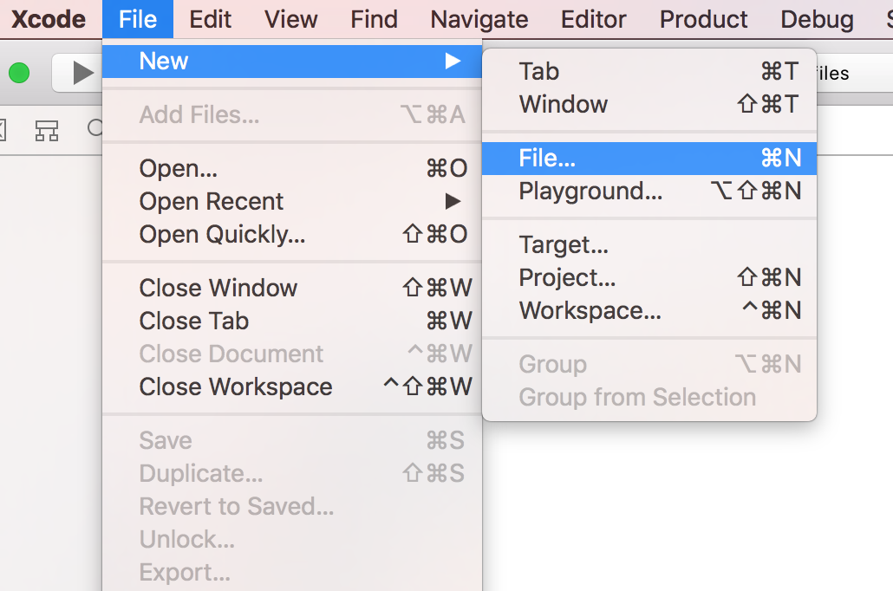
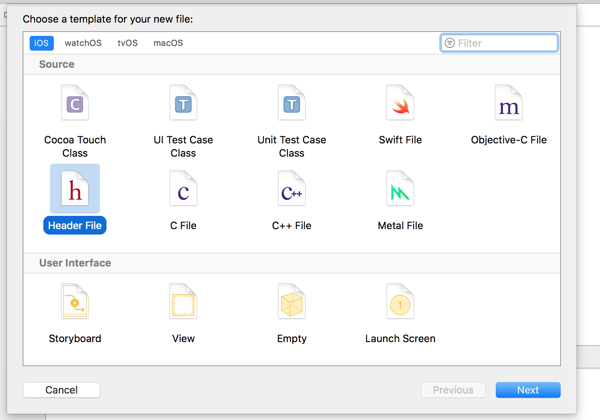
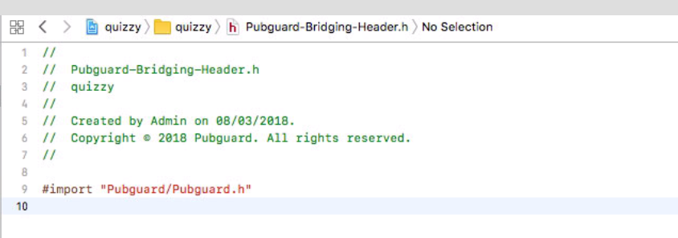
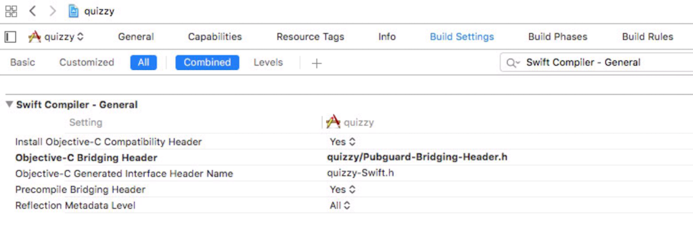
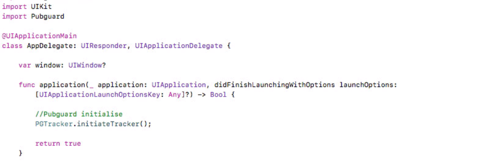

# Adding a Bridging Header to your Swift app

This is a quick guide explaining how to add a bridging header if you have built your app in Swift and are using the Pubguard Library.

## Getting Started

### Create your Bridging Header File

Create a new file in your project:

Select 'header file' and name it Pubguard-Bridging-Header

### Update your Bridging Header File

Add **#import 'Pubguard/Pubguard.h'** to new header file, this will allow you to import the Pubguard Library in your Swift app

### Update your Build Settings to include the Bridging Header

In **Project Settings -> Build Settings** search for *"Swift Compiler - Code Generation"*  add the Bridging header to the line *Objective-C Bridging Header*

### That's it! You should now be able to access the library as normal:

## License

*© 2018 Minimised Media Limited (Pubguard)*