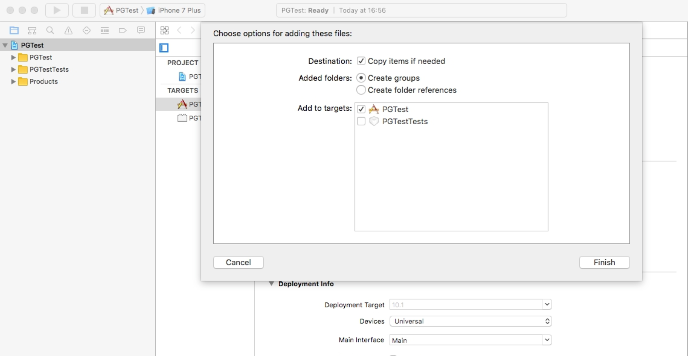
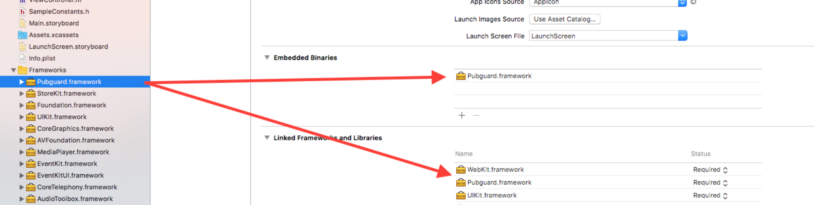
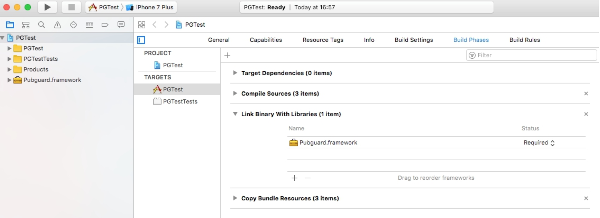
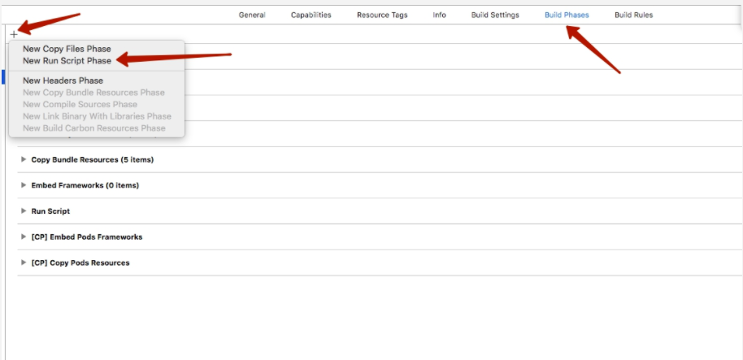
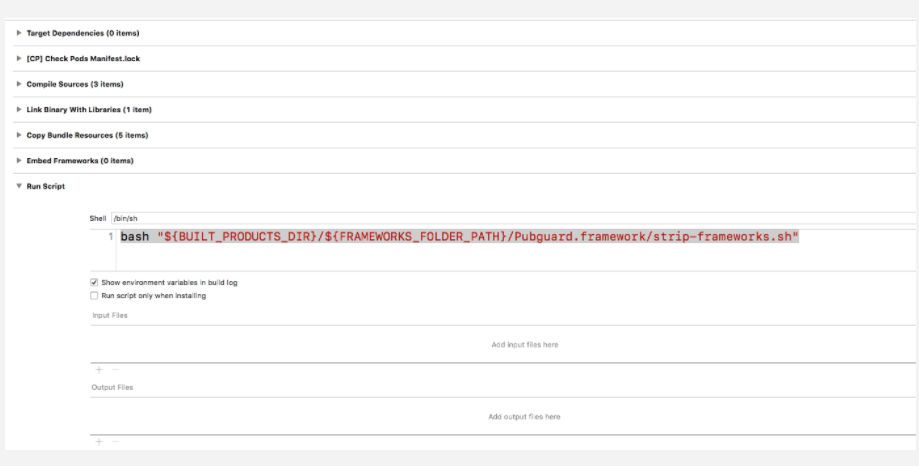
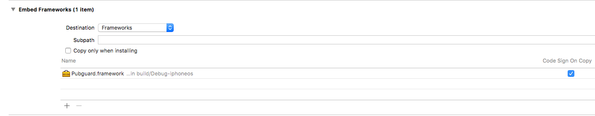

# Adding the iOS Library manually

Please request the Pubguard Library from support@pubguard.com which will have the key embedded in it.

Once received copy the Pubguard.framework into your Xcode project and add it to all targets that will link to Pubguard:



Add the Pubguard Library to Target > General > Embedded Binaries. If you add the framework to "embedded binaries", the framework will also be added to "Linked Frameworks and Libraries".





Download file [strip-frameworks.sh](strip-frameworks.sh) and put this file in root folder of your project.

In Project Navigator choose your project and go to "Build Phases" and in the top left corner find and press "add" button. Hit "New Run Script Phase" and choose new "Run Script".



Add the following Build script

```
bash "${SRCROOT}/${PROJECT_NAME}/strip-frameworks.sh"
```



Also in "Build Phases" add Pubguard framework in "Embed Frameworks".


